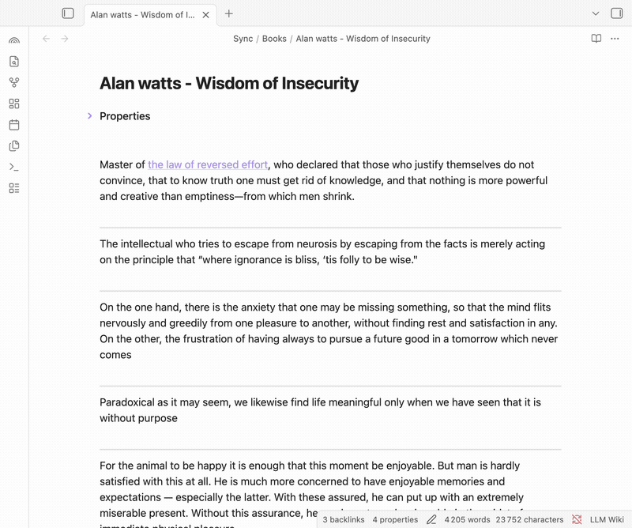
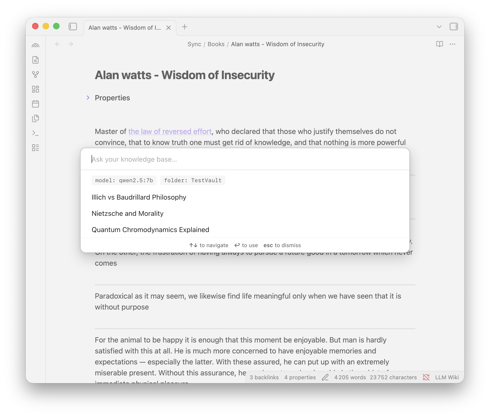
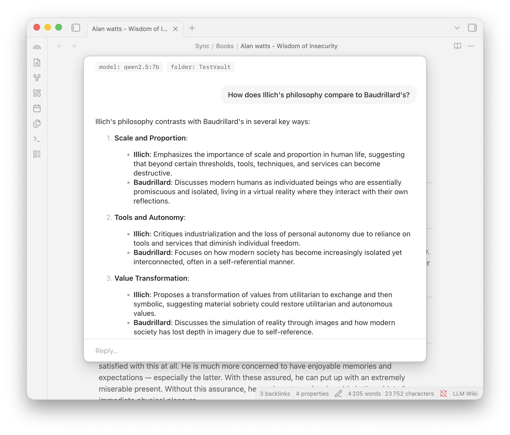
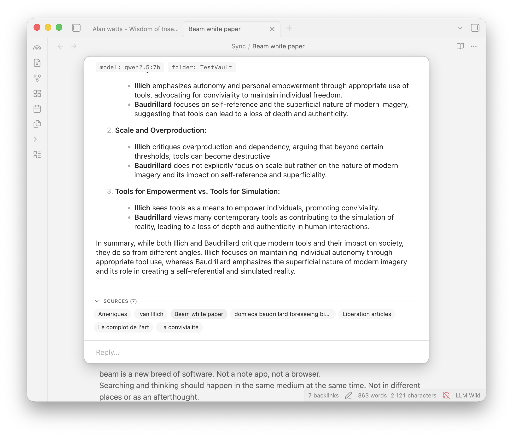
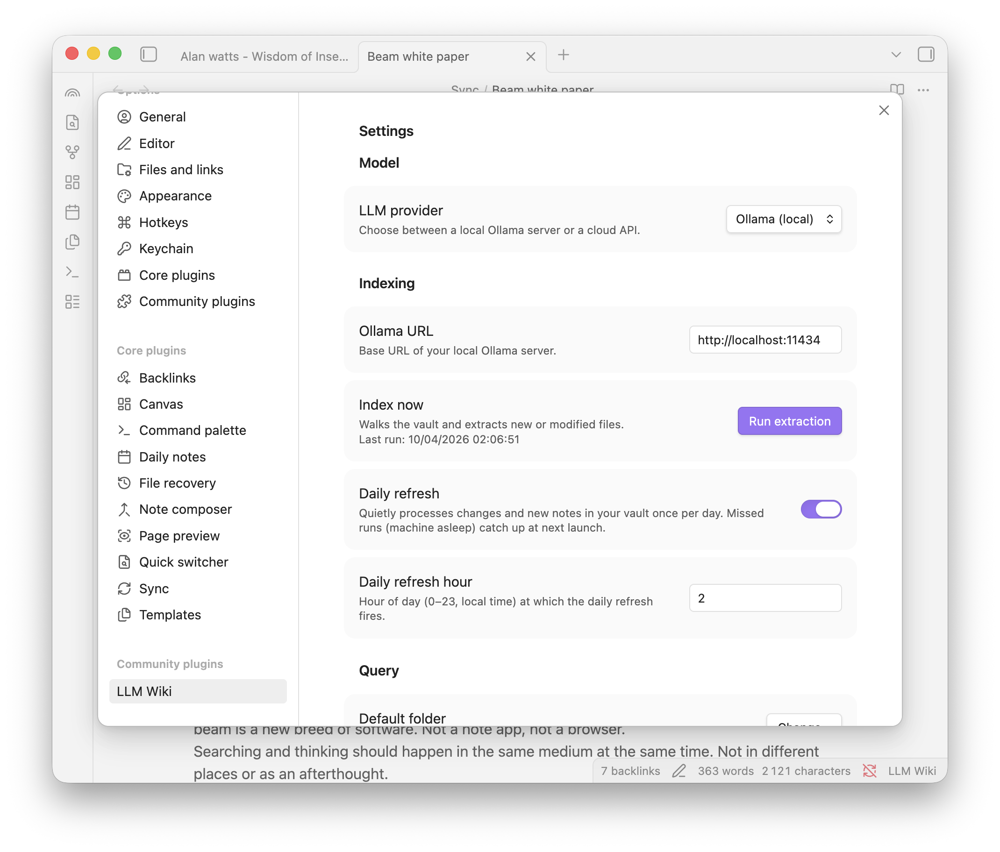

# LLM Wiki

This project was inspired by [Andrej Karpathy's post on LLM knowledge bases](https://x.com/karpathy/status/2039805659525644595) — using LLMs to compile personal notes into a structured, queryable wiki. LLM Wiki is an attempt to package that workflow into something anyone can use, privately, right inside Obsidian.

---

Your notes already contain a wealth of knowledge — scattered across files, half-connected, hard to query. LLM Wiki reads your Obsidian vault, extracts the people, ideas & connections, and lets you ask questions in natural language. TLDR: privately chat with your notes.

Everything runs locally on your machine. No cloud account required. Your notes never leave your computer. You can also use Anthropic, OpenAI or Gemini if you wish.



## Quick start

You need two things: [Ollama](https://ollama.com) (a free, local LLM runtime) and the plugin itself.

**1. Install Ollama and pull the models**

Download Ollama from [ollama.com](https://ollama.com), or install it from the terminal with `brew install ollama` (Mac) or `curl -fsSL https://ollama.com/install.sh | sh` (Linux). Then run:

```bash
ollama pull qwen2.5:7b
ollama pull nomic-embed-text
```

The first model (`qwen2.5:7b`, ~4.7 GB) reads your notes and answers your questions. The second (`nomic-embed-text`, ~275 MB) powers semantic search — it's what lets the plugin find relevant notes even when you don't use the exact same words.

As of April 2026, both models are the most reasonable option for an average local setup.

**2. Install the plugin**

Install LLM Wiki from the Community Plugins browser in Obsidian, or manually drop a [release](https://github.com/domleca/llm-wiki/releases) into `.obsidian/plugins/llm-wiki/`. Enable it in Settings > Community plugins.

<!-- Once accepted in the community directory, users can also install via: obsidian://show-plugin?id=llm-wiki -->

**3. Index your knowledge base**

Open the command palette (`Cmd+P` / `Ctrl+P`) and run **LLM Wiki: Run extraction now**. The plugin walks your vault, sends each note to the local model, and builds a structured knowledge base. Progress shows in the status bar.

> **This takes a while.** The first extraction processes every note one by one. On a 600-note vault with a MacBook Air M2 (16 GB) running `qwen2.5:7b` locally, it took about **4 hours**. Larger vaults or older machines will take longer. Good time to start it before bed. If you're on a Mac laptop, keep it awake with `caffeinate` in a terminal:
>
> ```bash
> caffeinate -i
> ```
>
> After the first run, only changed notes are re-extracted — updates take seconds, not hours.

**4. Ask your vault a question**

Run the command **Ask knowledge base** (or click the ribbon icon). Type a question. Answers stream in with clickable links back to the source notes.

> **Tip:** Set a hotkey for quick access. Go to Settings > Hotkeys, search for "Ask knowledge base", and assign a shortcut — `Shift+Cmd+K` works well.

That's it. You're running.

## What it does

- **Extracts knowledge from your notes** — entities (people, organizations, tools, books, places, events), concepts (ideas, theories, frameworks), and 9 types of connections between them.
- **Answers questions in natural language** — a chat interface grounded in your own writing, with source links so you can verify every answer.
- **Hybrid search** — combines keyword matching, semantic similarity, and vault structure to find the right context, even when your question uses different words than your notes.
- **Knows when it doesn't know** — if your vault doesn't have enough on a topic, it says so instead of making things up.
- **Generates wiki pages** — structured markdown pages for every entity, concept, and source, organized in `wiki/` folders compatible with Obsidian [Bases](https://obsidian.md/bases).
- **Keeps up with your writing** — saving a note triggers background re-extraction. Optional nightly full re-index of new items.
- **Multi-turn conversations** — chats are saved and resumable. Pick up where you left off.
- **Multiple providers** — Ollama (local, free) by default. OpenAI, Anthropic, and Google available as options in settings.

| | |
|---|---|
|  |  |
|  |  |

## Commands

| Command | What it does |
|---|---|
| Ask knowledge base | Open the chat modal |
| Run extraction now | Re-index your entire vault |
| Extract current file | Re-extract only the active note |
| Cancel running extraction | Stop an in-progress extraction |
| Regenerate pages from KB | Rebuild all wiki pages |
| Reload knowledge base from disk | Reload the KB without re-extracting |
| Show vocabulary | Inspect the raw knowledge base |

## Cloud providers (optional)

The default setup is fully local — nothing to sign up for, nothing to pay for. If you want to use a cloud model instead (faster, or for larger vaults), go to Settings > LLM Wiki, pick a provider, and enter your API key.

| Provider | Chat models | Embedding |
|---|---|---|
| Ollama (default) | qwen2.5:7b and others | nomic-embed-text |
| OpenAI | GPT-4o, GPT-4o mini | text-embedding-3-small |
| Anthropic | Claude Sonnet, Haiku | uses Ollama fallback |
| Google | Gemini 2.0 Flash | text-embedding-004 |

Cloud providers send note content to the provider's API. If privacy matters, stick with Ollama.

## Keeping your vault intact

Your existing notes are never modified. Everything the plugin generates lives in a single `wiki/` folder:

```
wiki/
  kb.json            knowledge base (the structured data)
  index.md           catalog page
  entities/          one page per entity
  concepts/          one page per concept
  sources/           one page per source note
```

By default, the `wiki/` folder is hidden from search, Quick Switcher, and graph view — it won't clutter your vault or interfere with your links. If you're curious and want to browse the generated pages, you can make them visible in Settings > LLM Wiki > Appearance. Either way, your normal vault stays exactly as it was.

## How it works

LLM Wiki turns your unstructured notes into a structured knowledge base, then uses that structure to answer questions. Here's what happens under the hood:

**Extraction.** When you run extraction, the plugin reads each note in your vault and sends it to an LLM with a prompt like "what entities, concepts, and connections are in this text?" The model returns structured data — names, types, descriptions, relationships — which gets merged into a single knowledge base (`wiki/kb.json`). Think of it as the plugin reading all your notes and building a mental map of everything in them.

**Page generation.** From that knowledge base, the plugin writes one markdown page per entity, concept, and source note into `wiki/` folders. These pages are plain markdown with frontmatter, so they work with Obsidian's Bases feature for filtering and sorting. You get a browsable wiki of your own knowledge, automatically maintained.

**Retrieval.** When you ask a question, the plugin doesn't send your entire vault to the LLM — that would be too slow and too large. Instead, it searches the knowledge base to find the most relevant pieces of context. It uses three strategies in parallel: keyword matching (finding notes that contain the same terms), semantic similarity (finding notes that mean similar things, even with different words — this is what the embedding model does), and vault structure (prioritizing notes in folders you've scoped). The results are merged using a technique called Reciprocal Rank Fusion, which combines multiple ranked lists into one.

**Answering.** The top-ranked context gets bundled into a prompt along with your question and any conversation history, then sent to the LLM. The answer streams back token by token. Afterward, the plugin cross-references the answer against the retrieved sources and shows them as clickable links so you can verify the grounding yourself.

**Keeping up to date.** When you save a note, the plugin re-extracts just that file in the background — no need to re-index the whole vault. There's also an optional nightly scheduler for a full refresh.

## Privacy

- With Ollama (the default), all processing happens on your machine. Nothing is sent anywhere.
- Cloud providers require sending note content to their APIs. This is opt-in and clearly labeled in settings.
- No telemetry, analytics, or tracking of any kind.

## Development

```bash
npm install
npm test           # 476 tests
npm run typecheck  # strict TypeScript
npm run lint
npm run build      # production build
npm run dev        # watch mode
```

## License

[MIT](LICENSE)
